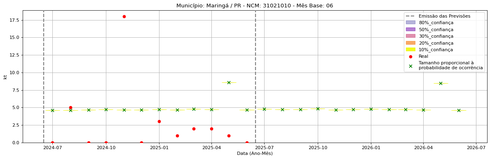
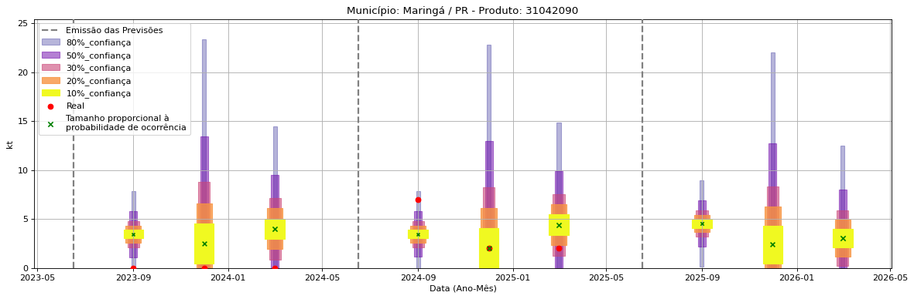
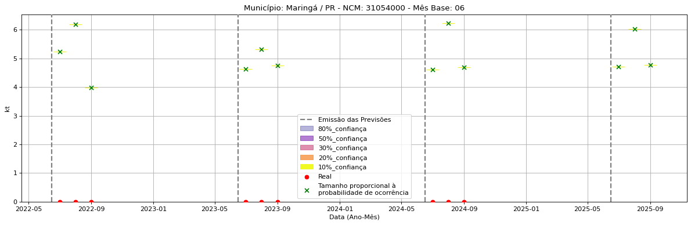

<header>
    <h1><a href="https://quantimportbrazil.github.io/Sobre/">QuantImport</a></h1>
</header>

---

# Previsão de Importação - Maringá-PR

> **Emissão:** 06-2025
> Para fins de comparação, também apresentamos a seguir previsões e valores reais de períodos anteriores ao atual.
> As previsões foram geradas com base em dados limitados até o mês 6.

---

**[Home](https://quantimportbrazil.github.io/Sobre/)** | **[Selecionar Estado (UF)](https://quantimportbrazil.github.io/Unidades_Federativas/)**

Fator de Influência em Destaque nos últimos 8 anos:

Previsão Influenciada:
- Município: Maringá
- Produto (NCM): Ureia, mesmo em solução aquosa, com teor de nitrogênio (azoto) superior a 45 %, em peso, calculado sobre o produto anidro no estado seco-31021010 
- Mês: 09

Fator Influenciador: Comércio Exterior
- Produto: Sementes e frutos oleaginosos; grãos, sementes e frutos diversos; plantas industriais ou medicinais; palhas e forragens (12)
- UF: RS
- Unidade: sm_diff

Fator de Influência em Destaque nos últimos 8 anos:

Previsão Influenciada:
- Município: Maringá
- Produto (NCM): Outros cloretos de potássio-31042090 
- Mês: 08

Fator Influenciador: Comércio Exterior
- Produto: Adubos (fertilizantes) (31)
- UF: RS
- Unidade: price_mun

Fator de Influência em Destaque nos últimos 8 anos:

Previsão Influenciada:
- Município: Maringá
- Produto (NCM): Diidrogeno-ortofosfato de amônio (fosfato monoamônico ou monoamoniacal), mesmo misturado com hidrogeno-ortofosfato de diamônio (fosfato diamônico ou diamoniacal)-31054000 
- Mês: 12

Fator Influenciador: Comércio Exterior
- Produto: Sementes e frutos oleaginosos; grãos, sementes e frutos diversos; plantas industriais ou medicinais; palhas e forragens (12)
- UF: PR
- Unidade: kt_lag12

